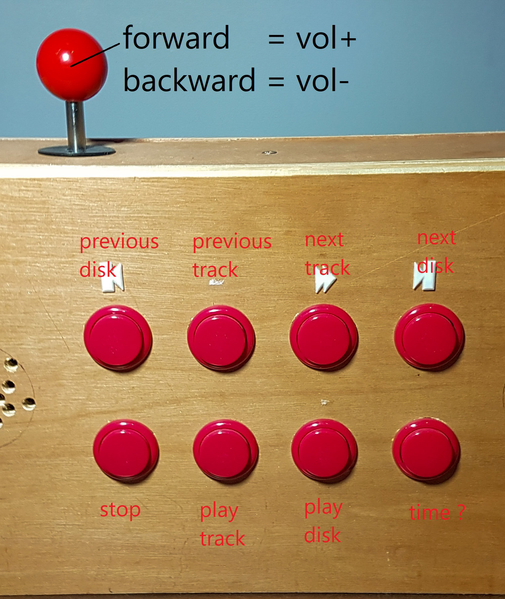
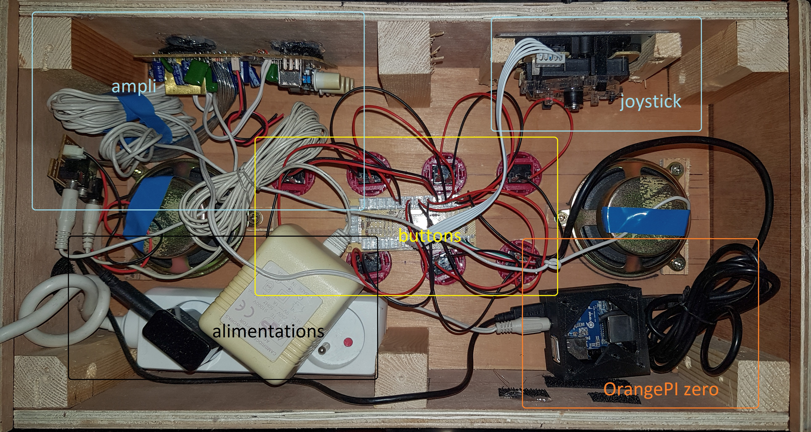

= conteur

_Conteur_ is a simple jukebox application.

== description

.Overview

It is targeted for Raspberry Pi equiped only with joystick and a loud speaker (no screen).
It provides the usual functions :

|===
| previous disc | previous track    | next track | next disk
|               |play disc          | play track | tells time
|===

.the buttons

It speaks out loud the title (filename) of the disc and track.

== install

=== Hardware

.inside

 . Orangepi zero + audio extension board
 . arcade joystick kit with USb
 . PC loudspeakers with 3.5 jack
 . triplette + power supplies

=== orangepi zero

[source,bash]
.$>sh
----
sudo apt-get update
sudo apt-get upgrade
sudo apt-get install -y git curl wget
----

==== sound card

[source,bash]
.$>sh
----
sudo armbian-config
# enables : system > hardware > analog-device
sudo apt-get install sox libsox-fmt-all
alsamixer # set volume
# test
wget https://www.soundhelix.com/examples/mp3/SoundHelix-Song-1.mp3
play SoundHelix-Song-1.mp3
----

==== samba (optional)

[source,bash]
.$>sh
----
sudo apt-get install -y samba samba-common-bin
sudo mkdir /shared
sudo nano /etc/samba/smb.conf
sudo smbpasswd -a $USER
sudo systemctl restart smbd
----

[source,ini]
./etc/samba/smb.conf
----
[shared]
path = /shared
writeable=Yes
create mask=0777
directory mask=0777
public=yes
----

=== pygame
pygame, ...

Text-to-speech  will use internet connexion if available, or use the raspberry pi capabilities as fallback.

Targeted for linux, but can also run on windows.

[source,bash]
.$>sh
----
# sudo apt install libsdl2-dev libfreetype6-dev libsdl2-mixer-dev libsdl2-image-dev libsdl2-ttf-dev libjpeg-dev libpng-dev libportmidi-dev
sudo apt install -y python3-pip python3-setuptools python3-pygame
----

=== install from source

[source,bash]
.$>sh
----
# local fr_FR.UTF-8 is not installed on your system
sudo nano /etc/locale.gen
# uncomment  every line which you want to generate.
sudo locale-gen

git clone https://github.com/jujumo/conteur.git
cd conteur
sudo make install
----

=== diagnose

systemd-analyze blame
